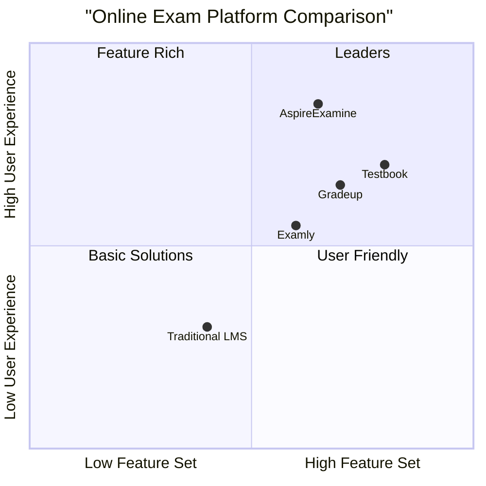

## 3. Competitive Analysis

### 3.1 Competitive Analysis Table

| Feature | AspireExamine | Testbook | Gradeup | Examly |
|---------|--------------|----------|---------|--------|
| No Registration Required | ✅ | ❌ | ❌ | ❌ |
| Real-time Updates | ✅ | ✅ | ❌ | ✅ |
| PDF Reports | ✅ | ✅ | ✅ | ✅ |
| Image Support | ✅ | ✅ | ✅ | ✅ |
| Session Backup | ✅ | ✅ | ❌ | ❌ |

### 3.2 Competitive Advantages
1. No-registration approach reduces friction
2. Modern tech stack ensures better performance
3. Real-time capabilities enhance user experience
4. Automated PDF generation saves time
5. Session persistence provides reliability

